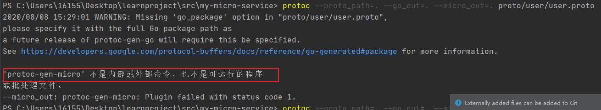

## 执行`protoc --proto_path=. --go_out=. --micro_out=. proto/user/user.proto`报错

- 1、提示`protoc`不是内部命令
  - 解决：需要下载protoc，并且把protoc.exe的路径放（powershell）环境变量

- 2、提示'protoc-gen-micro' 不是内部或外部命令
  - ·解决：需要安装protoc-gen-micro，`go get -u -v github.com/micro/protoc-gen-micro`

- 再次执行`protoc --proto_path=. --go_out=. --micro_out=. proto/user/user.proto`即可
## dataGrip不能远程连接MySQL
- 背景：在docker中装MySQL，并映射3306端口到宿主机；`sudo firewall-cmd --add-port=3306/tcp^C`防火墙开放3306端口；ECS本地连接成功；在自己电脑上可以ping IP，但`Telnet 47.115.13.137 3306`一直失败
- 问题分析：在本地lsof查看3306端口是开启的，ECS本地连接成功，但Telnet不成功，说明问题在防火墙。
- 解决：阿里云控制台添加安全组就可以外网连接。
## docker中安装MySQL
- https://zhuanlan.zhihu.com/p/80029398
## docker中安装etcd
- https://blog.csdn.net/ucmir183/article/details/84454575?utm_source=app
## go mod 锁定引用包
- 背景：main中引用go-micro，go-micro引用google.golang.org/grpc，因为版本问题，build时提示结构体undefined。
- 解决：go mod中replace指定包版本`replace google.golang.org/grpc => google.golang.org/grpc v1.26.0`